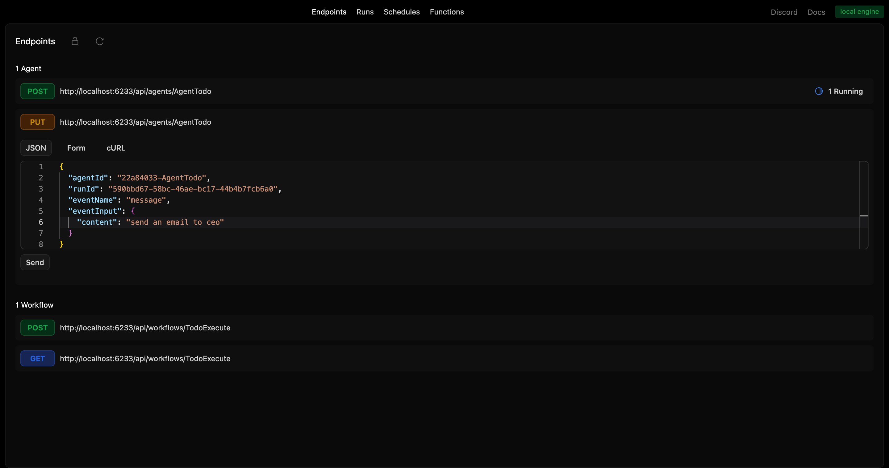
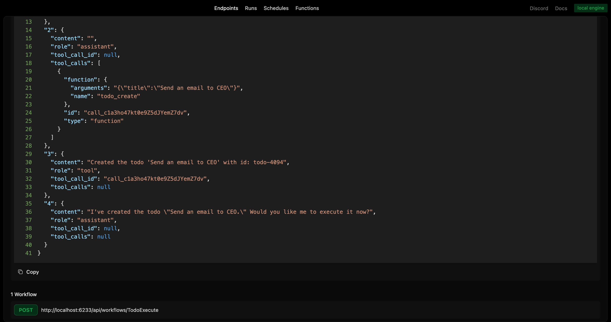
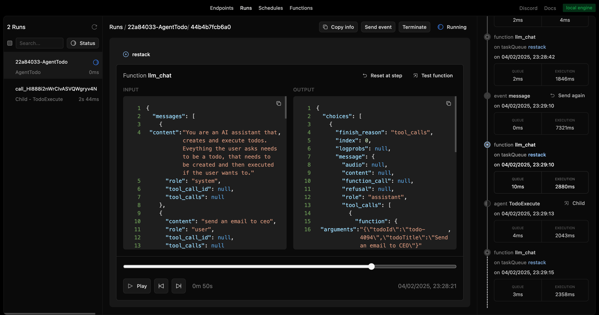
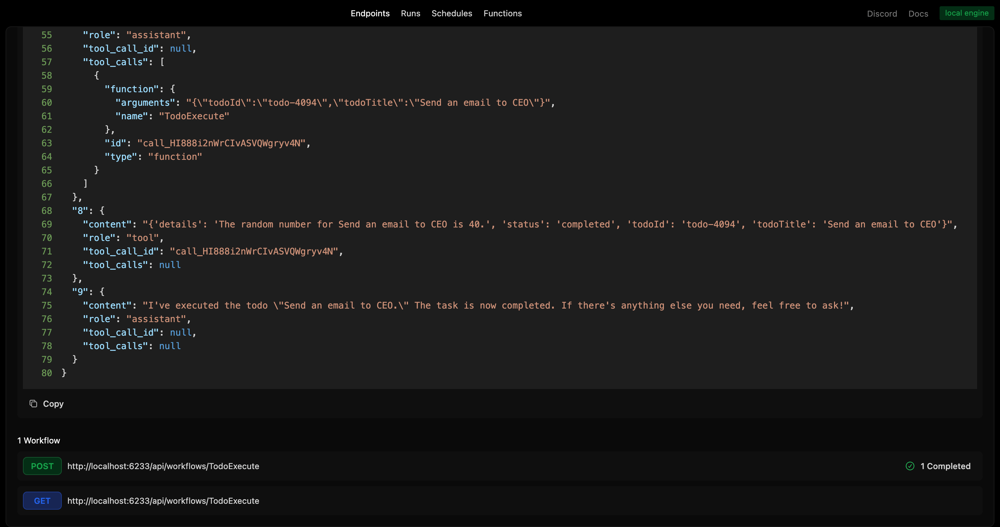
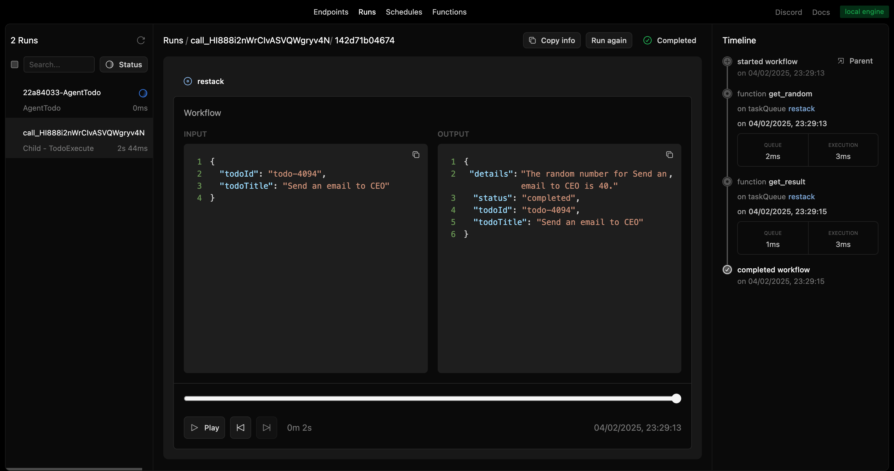

# Restack AI - Backend Python Services

This repository contains the Python backend services for the Restack AI application.
It demonstrates how to set up agents with tool calls, workflows, and database functions.

## Prerequisites

- Docker (for running Restack)
- Python 3.10 or higher

## Start Restack

To start the Restack, use the following Docker command:

```bash
docker run -d --pull always --name restack -p 5233:5233 -p 6233:6233 -p 7233:7233 -p 9233:9233 -p 10233:10233 ghcr.io/restackio/restack:main
```

## Start python shell

If using uv:

```bash
uv venv && source .venv/bin/activate
```

If using pip:

```bash
python -m venv .venv && source .venv/bin/activate
```

## Install dependencies and run

**Development mode** (with file watching):
```bash
uv run dev
# or with pnpm from the monorepo root:
pnpm --filter backend-py dev
```

**Production mode** (runs Restack services):
```bash
uv run start  
# or with pnpm from the monorepo root:
pnpm --filter backend-py start
```

**Alternative setup with pip:**
```bash
pip install -e .
python -c "from src.services import watch_services; watch_services()"  # dev mode
python -c "from src.services import run_services; run_services()"  # start mode
```

## Run agents

### from UI

You can run agents from the UI by clicking the "Run" button.



### from API

You can run agents from the API by using the generated endpoint:

`POST http://localhost:6233/api/agents/AgentTask`

### from any client

You can run agents with any client connected to Restack, for example:

If using uv:

```bash
uv run schedule
```

If using pip:

```bash
python -c "from schedule import run_schedule; run_schedule()"
```

executes `schedule.py` which will connect to Restack and execute the `AgentTask` agent.

## Send an event to the agent

In our example we will ask the AI agent to perform a task.

### from UI

```
{
  "agentId": "{agent_id}",
  "runId": "{run_id}",
  "eventName": "messages",
  "eventInput": {
    "messages": [{"role": "user", "content": "Help me analyze this data"}]
  }
}
```



You can send events to the agent by using the generated endpoint:

`PUT http://localhost:6233/api/agents/AgentTask/:agentId/:runId`

and the payload:

```
{
  "eventName": "messages",
  "eventInput": {
    "messages": [{"role": "user", "content": "Help me analyze this data"}]
  }
}
```

## See the agent run

The LLM will use tool calls to interact with various services and MCP servers.
The agent can perform database operations, call external APIs, and execute workflows.

You can replay and follow the agent run in the UI.



Now, you can simply trigger more events from the Developer UI.

The agent can process messages, handle MCP tool approvals, and execute complex workflows.



When using MCP tools that require approval, the agent will wait for confirmation before proceeding.



## Deploy on Restack Cloud

To deploy the application on Restack, you can create an account at [https://console.restack.io](https://console.restack.io)
